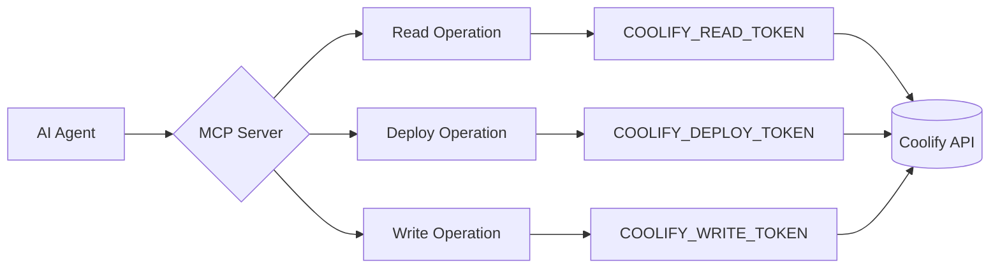

# 🔌 Coolify MCP Server — OpenCode Entegrasyon Rehberi

> **Türkçe — Teknik ve samimi bir dille, projeye yeni katılan herkesin anlayabileceği şekilde hazırlanmıştır.**

Bu doküman, **Coolify MCP Server**'ı OpenCode'dan kullanmak için bilmeniz gereken her şeyi adım adım anlatır. 42 MCP aracı (tool) ile Coolify altyapınızı AI asistanınıza emanet edebilir, güvenli bir şekilde deploy edebilir ve izleyebilirsiniz.

---

## 📋 İçindekiler

1. [Proje Özellikleri](#1-proje-özellikleri)
2. [OpenCode'a Eklendiğinde Yapılabilecek İşlemler](#2-opencodea-eklendiğinde-yapılabilecek-işlemler)
3. [OpenCode Yapılandırması](#3-opencode-yapılandırması)
4. [Yetkiler ve Operation Mode'lar](#4-yetkiler-ve-operation-modelar)
5. [Örnek Kullanım Senaryoları](#5-örnek-kullanım-senaryoları)
6. [42 Tool Kataloğu](#6-42-tool-kataloğu)
7. [Güvenlik](#7-güvenlik)
8. [Kurulum (Hızlı Başlangıç)](#8-kurulum-hızlı-başlangıç)
9. [Dashboard](#9-dashboard)

---

## 1. Proje Özellikleri

Coolify MCP Server, bir AI asistanının (OpenCode, Claude, Copilot, Cursor vb.) Coolify altyapınızı güvenli bir şekilde yönetmesini sağlayan **production-grade** bir MCP (Model Context Protocol) sunucusudur.

### 🚀 42 MCP Tool'u

Sunucuda kayıtlı **42 adet MCP aracı** bulunur:

| Kategori | Adet | Açıklama |
|----------|:----:|----------|
| **Read-only araçlar** | 25 | Sadece okuma — liste, getir, sorgula |
| **Action araçları** | 17 | Deploy, restart, oluşturma, güncelleme |

Bu araçlar 10 farklı domain'e ayrılmıştır: core read, GitHub keşfi, scheduled task'ler, deployment'lar, backup'lar, server'lar, takımlar, konfigürasyon, storage ve environment variable'lar.

### 🔐 3 Operation Mode

| Mod | Ne işe yarar? |
|-----|---------------|
| `read-only` | Sadece izleme — production'da bile güvenle kullanılır |
| `deploy-only` | Oku + deploy et — yazma işlemleri engellenir |
| `safe-write` | Tüm yetkiler — stop ve env yazma ek izin gerektirir |

### 🩸 Secret Redaction

- Environment variable **VALUE'ları ASLA döndürülmez** — sadece KEY'ler ve metadata görünür
- Log'lar `Bearer` token, `password`, `secret`, `api_key` gibi kalıplara karşı taranır ve otomatik redakte edilir
- SSH private key, database URL, email adresleri gibi hassas alanlar `[REDACTED]` olarak döner
- Audit event'leri asla secret değer içermez

### 🛡️ Production Guard

Production ortamında mutation'lar **varsayılan olarak TAMAMEN ENGELLENİR**.

| Varsayılan | Değer | Etkisi |
|-----------|-------|--------|
| `COOLIFY_DENY_PRODUCTION_MUTATIONS` | `true` | Production'da deploy dahil hiçbir mutation çalışmaz |
| `COOLIFY_ALLOW_PRODUCTION_DEPLOY` | `false` | Production deploy'a özel izin |
| `COOLIFY_ALLOW_STOP` | `false` | Stop işlemi globalde engelli |
| `COOLIFY_ALLOW_ENV_WRITE` | `false` | Env var yazma globalde engelli |

Production ortamları varsayılan olarak `production,prod` isimleriyle tanınır (case-insensitive).

### 🎟️ Least-Privilege Token Seçimi

Tek bir master token yerine **5 farklı scopeta token** tanımlayabilirsiniz:

| Token | Kullanım Yeri |
|-------|---------------|
| `COOLIFY_READ_TOKEN` | Tüm okuma işlemleri |
| `COOLIFY_SENSITIVE_TOKEN` | Hassas veri okuma (env var'lar, log'lar) |
| `COOLIFY_WRITE_TOKEN` | Yazma işlemleri |
| `COOLIFY_DEPLOY_TOKEN` | Deploy/start/restart |
| `COOLIFY_API_TOKEN` | Hiçbiri yoksa fallback (full access) |

Sunucu her işlem için **en düşük yetkiye sahip token'ı** otomatik seçer.

### 📊 Web Dashboard

- MCP sunucusuyla aynı anda otomatik başlar
- Adres: **http://127.0.0.1:6489**
- Global arama, command palette (Ctrl+K), dark/light mode
- Tüm 42 tool görüntülenebilir, audit log izlenebilir
- KPI kartları ile anlık durum

Kapatmak için: `MCP_DASHBOARD_ENABLED=false`

### 📝 Audit Logging

Tüm mutation işlemleri yapılandırılmış audit event'leri olarak kaydedilir:

| Audit Event | Ne Zaman |
|-------------|----------|
| `coolify.deployment.cancel` | Deployment iptal edildiğinde |
| `coolify.database_backup_config.create` | Yedek konfigürasyonu oluşturulduğunda |
| `coolify.scheduled_task.create` | Scheduled task oluşturulduğunda |
| `coolify.application.config.update` | Uygulama konfigürasyonu güncellendiğinde |
| `coolify.database.config.update` | Veritabanı konfigürasyonu güncellendiğinde |
| `coolify.storage.create` | Storage mount oluşturulduğunda |

Her audit event'i: operasyon adı, kaynak (resource), sonuç (allowed/denied/error) ve süre bilgisini içerir.

---

## 2. OpenCode'a Eklendiğinde Yapılabilecek İşlemler

Coolify MCP Server, OpenCode içinden doğrudan çağrılabilen 42 araç sunar. Bunları kategorilere ayıralım.

### 📖 Okuma (Her zaman açık — tüm modlarda)

```
┌──────────────────────────────────────────────────────┐
│                    READ TOOLS (25)                    │
│          Tüm modlarda kullanılabilir                  │
└──────────────────────────────────────────────────────┘
```

| İşlem | Araç Adı | Ne Yapar? |
|-------|----------|-----------|
| **Projeleri listele** | `coolify_list_projects` | Tüm projeleri isim filtresiyle getirir |
| **Proje detayı** | `coolify_get_project` | UUID ile proje ve ortam bilgisi |
| **Proje özeti** | `coolify_project_overview` | Proje + ortamlar + kaynaklar + deployment'lar — 4 API çağrısını tek seferde toplar |
| **Kaynakları listele** | `coolify_list_resources` | Proje, ortam, tür, durum filtresiyle |
| **Kaynak detayı** | `coolify_get_resource` | Uygulama/servis/veritabanı detayı |
| **Deployment'ları listele** | `coolify_list_deployments` | En yeniden eskiye, durum filtresiyle |
| **Deployment detayı** | `coolify_get_deployment` | Status, timestamp, commit, hata özeti |
| **Log oku** | `coolify_get_application_logs` | Secret redaction ile log satırları |
| **Env var KEY'leri** | `coolify_list_environment_variables` | **VALUE'lar asla döndürülmez** |
| **GitHub App'leri** | `coolify_list_github_apps` | Bağlı GitHub App'leri |
| **Repo keşfi** | `coolify_list_repositories` | GitHub App üzerinden erişilebilir repo'lar |
| **Branch keşfi** | `coolify_list_branches` | Repo'daki branch'ler |
| **Scheduled task'ler** | `coolify_list_scheduled_tasks` | Cron job'ları listesi |
| **Task execution'ları** | `coolify_get_task_executions` | Cron çalıştırma geçmişi |
| **Backup listesi** | `coolify_list_database_backups` | Yedek konfigürasyonları ve execution'ları |
| **Server listesi** | `coolify_list_servers` | Tüm sunucular (hassas bilgiler redakte) |
| **Server detayı** | `coolify_get_server` | Tek sunucu detayı |
| **Server kaynakları** | `coolify_list_server_resources` | Sunucu üzerindeki kaynaklar |
| **Server domain'leri** | `coolify_list_server_domains` | Sunucuya bağlı domain'ler |
| **Takım bilgisi** | `coolify_get_current_team` | Aktif takım ID, isim, yetki |
| **Takım üyeleri** | `coolify_list_team_members` | Email'ler varsayılan olarak redakte |
| **Storage mount'lar** | `coolify_list_storages` | Volume/bind mount'ları |
| **Sağlık kontrolü** | `coolify_health` | MCP + Coolify API bağlantı durumu |

### 🚀 Deploy (deploy-only veya safe-write modda)

```
┌──────────────────────────────────────────────────────┐
│                   DEPLOY TOOLS (4)                    │
│    deploy-only ve safe-write modlarında açık          │
└──────────────────────────────────────────────────────┘
```

| İşlem | Araç Adı | Ne Yapar? |
|-------|----------|-----------|
| **Deploy başlat** | `coolify_deploy` | Kaynağı deploy eder (force=POST, normal=GET) |
| **Restart** | `coolify_restart` | Kaynağı yeniden başlatır |
| **Start** | `coolify_start` | Duran kaynağı başlatır |
| **Deployment iptal** | `coolify_cancel_deployment` | Sıradaki veya devam eden deployment'ı iptal eder |

### ✍️ Yazma (safe-write modda, ek izinlerle)

```
┌──────────────────────────────────────────────────────┐
│                    WRITE TOOLS (13)                   │
│      safe-write modu + ek COOLIFY_ALLOW_* izinleri   │
└──────────────────────────────────────────────────────┘
```

| İşlem | Araç Adı | Ek İzin | Açıklama |
|-------|----------|---------|----------|
| **Env var ekle/güncelle** | `coolify_set_environment_variable` | `ALLOW_ENV_WRITE=true` | Tek env var |
| **Env var bulk** | `coolify_set_environment_variables` | `ALLOW_ENV_WRITE=true` | 1-50 arası toplu env var |
| **Stop** | `coolify_stop` | `ALLOW_STOP=true` | Kaynağı durdurur ⚠️ |
| **Proje oluştur** | `coolify_create_project` | — | Yeni proje |
| **Ortam oluştur** | `coolify_create_environment` | — | Projeye yeni ortam |
| **Uygulama oluştur** | `coolify_create_application` | — | Yeni uygulama |
| **Servis oluştur** | `coolify_create_service` | — | Docker-compose servisi |
| **Veritabanı oluştur** | `coolify_create_database` | — | PostgreSQL/MySQL/Redis vb. |
| **Scheduled task oluştur** | `coolify_create_scheduled_task` | — | Cron job tanımla |
| **Scheduled task güncelle** | `coolify_update_scheduled_task` | — | Cron job'u düzenle |
| **Backup config oluştur** | `coolify_create_backup_config` | — | Yedekleme planı |
| **Storage mount oluştur** | `coolify_create_storage` | — | Volume/bind mount |
| **Server doğrula** | `coolify_validate_server` | — | Bağlantı ve konfig doğrulama |
| **App config güncelle** | `coolify_update_application_config` | — | Health check, CPU, RAM, replika |
| **DB config güncelle** | `coolify_update_database_config` | — | CPU/RAM limit, isim, açıklama |

> ⚠️ **Stop** ve **Env Write** işlemleri varsayılan olarak KAPALIDIR. `COOLIFY_ALLOW_STOP=true` veya `COOLIFY_ALLOW_ENV_WRITE=true` ile açmanız gerekir.

---

## 3. OpenCode Yapılandırması

### 🖥️ Local (stdio) Kullanım

Coolify MCP Server'ı OpenCode'a **yerel (local/stdio)** olarak eklemek için `opencode.local.jsonc` dosyasına aşağıdaki gibi bir MCP tanımı ekleyin:

```jsonc
{
  "$schema": "https://opencode.ai/config.json",
  "mcp": {
    "coolify": {
      "type": "local",
      "command": ["node", "/path/to/mcp-coolify/dist/index.js"],
      "environment": {
        // ─── Zorunlu ────────────────────────────────────────
        "COOLIFY_URL": "https://coolify.ornek.com",
        "COOLIFY_API_TOKEN": "{env:COOLIFY_API_TOKEN}",

        // ─── Operation Mode ─────────────────────────────────
        // "read-only" (varsayılan) | "deploy-only" | "safe-write"
        "COOLIFY_OPERATION_MODE": "read-only",

        // ─── Production Koruması ────────────────────────────
        "COOLIFY_DENY_PRODUCTION_MUTATIONS": "true",
        "COOLIFY_ALLOW_STOP": "false",
        "COOLIFY_ALLOW_ENV_WRITE": "false"
      }
    }
  }
}
```

> ⚠️ **ÖNEMLİ**: `command` içinde `dist/index.mjs` değil `dist/index.js` kullanın! Build çıktısı ES module formatındadır ancak dosya uzantısı `.js`'dir. Repodaki örnek dosya (`examples/opencode.local.jsonc`) hatalı olarak `.mjs` yazabilir — gerçek çıktı `.js`'dir. Doğru yol: `/path/to/mcp-coolify/dist/index.js`

#### Scoped Token'lar ile Least-Privilege

```jsonc
{
  "$schema": "https://opencode.ai/config.json",
  "mcp": {
    "coolify": {
      "type": "local",
      "command": ["node", "/path/to/mcp-coolify/dist/index.js"],
      "environment": {
        "COOLIFY_URL": "https://coolify.ornek.com",

        // 5 farklı scoped token — her işlem en düşük yetkiyle yapılır
        "COOLIFY_READ_TOKEN": "{env:COOLIFY_READ_TOKEN}",
        "COOLIFY_SENSITIVE_TOKEN": "{env:COOLIFY_SENSITIVE_TOKEN}",
        "COOLIFY_WRITE_TOKEN": "{env:COOLIFY_WRITE_TOKEN}",
        "COOLIFY_DEPLOY_TOKEN": "{env:COOLIFY_DEPLOY_TOKEN}",
        "COOLIFY_API_TOKEN": "{env:COOLIFY_API_TOKEN}"   // fallback

        // Güvenli başlangıç: sadece oku
        "COOLIFY_OPERATION_MODE": "read-only"
      }
    }
  }
}
```

#### Deploy Yetkisi ile

```jsonc
{
  "$schema": "https://opencode.ai/config.json",
  "mcp": {
    "coolify": {
      "type": "local",
      "command": ["node", "/path/to/mcp-coolify/dist/index.js"],
      "environment": {
        "COOLIFY_URL": "https://coolify.ornek.com",
        "COOLIFY_API_TOKEN": "{env:COOLIFY_API_TOKEN}",
        "COOLIFY_OPERATION_MODE": "deploy-only"
      }
    }
  }
}
```

#### Tam Yetki (Dikkatli Kullanın!)

```jsonc
{
  "$schema": "https://opencode.ai/config.json",
  "mcp": {
    "coolify": {
      "type": "local",
      "command": ["node", "/path/to/mcp-coolify/dist/index.js"],
      "environment": {
        "COOLIFY_URL": "https://coolify.ornek.com",
        "COOLIFY_API_TOKEN": "{env:COOLIFY_API_TOKEN}",
        "COOLIFY_OPERATION_MODE": "safe-write",
        "COOLIFY_ALLOW_ENV_WRITE": "true",
        "COOLIFY_ALLOW_STOP": "true",
        "COOLIFY_DENY_PRODUCTION_MUTATIONS": "true" // production'u koru
      }
    }
  }
}
```

### 🌐 Remote (HTTP) Kullanım

Coolify MCP Server'ı uzaktan (HTTP/SSE transport ile) çalıştırıyorsanız:

```jsonc
{
  "$schema": "https://opencode.ai/config.json",
  "mcp": {
    "coolify-remote": {
      "type": "remote",
      "url": "https://coolify-mcp.ornek.com/mcp",
      "headers": {
        "Authorization": "Bearer {env:MCP_SERVER_API_KEY}"
      }
    }
  }
}
```

#### HTTP Transport Endpoint'leri

Sunucu HTTP modunda çalışırken (`MCP_TRANSPORT=http`) şu endpoint'leri sunar:

| Endpoint | Auth | Ne işe yarar? |
|----------|------|---------------|
| `GET /healthz` | ❌ | Liveness kontrolü (`{"ok":true,"status":"alive"}`) |
| `GET /readyz` | ❌ | Readiness kontrolü (Coolify API erişilebilir mi?) |
| `POST /mcp` | ✅ Bearer | Tüm MCP tool çağrıları buraya gider |

---

## 4. Yetkiler ve Operation Mode'lar

### Mode Karar Matrisi

| Tool Grubu | `read-only` | `deploy-only` | `safe-write` |
|------------|:-----------:|:-------------:|:------------:|
| **25 read tool** (list/get/health/logs/env-keys) | ✅ | ✅ | ✅ |
| `coolify_deploy` | ❌ | ✅ | ✅ |
| `coolify_restart` | ❌ | ✅ | ✅ |
| `coolify_start` | ❌ | ✅ | ✅ |
| `coolify_cancel_deployment` | ❌ | ✅ | ✅ |
| `coolify_stop` | ❌ | ❌ | ⛔ `ALLOW_STOP=true` |
| `coolify_set_environment_variable` | ❌ | ❌ | ⛔ `ALLOW_ENV_WRITE=true` |
| `coolify_set_environment_variables` (bulk) | ❌ | ❌ | ⛔ `ALLOW_ENV_WRITE=true` |
| `coolify_create_*` (proje/ortam/app/servis/db) | ❌ | ❌ | ✅ |
| `coolify_create_scheduled_task` | ❌ | ❌ | ✅ |
| `coolify_update_scheduled_task` | ❌ | ❌ | ✅ |
| `coolify_create_backup_config` | ❌ | ❌ | ✅ |
| `coolify_create_storage` | ❌ | ❌ | ✅ |
| `coolify_update_application_config` | ❌ | ❌ | ✅ |
| `coolify_update_database_config` | ❌ | ❌ | ✅ |
| `coolify_validate_server` | ❌ | ❌ | ✅ |

### Ek İzin Gate'leri (safe-write modunda bile kapalı)

| Gate | Env Değişkeni | Varsayılan | Açılınca |
|------|---------------|:----------:|----------|
| **Stop Gate** | `COOLIFY_ALLOW_STOP=true` | `false` | `coolify_stop` kullanılabilir |
| **Env Write Gate** | `COOLIFY_ALLOW_ENV_WRITE=true` | `false` | Env var ekleme/güncelleme açılır |
| **Production Deny** | `COOLIFY_DENY_PRODUCTION_MUTATIONS=true` | `true` | `false` yapınca production mutation'larına izin verir |
| **Production Deploy** | `COOLIFY_ALLOW_PRODUCTION_DEPLOY=true` | `false` | Production deploy'a özel izin |

### Production Guard Akışı

```
Bir action tool çağrıldı
        │
        ▼
┌───────────────────┐
│ Allow Gate Check  │ ← COOLIFY_ALLOW_STOP, ALLOW_ENV_WRITE
│ Açık mı?          │
└───────┬───────────┘
        │ (geçti)
        ▼
┌───────────────────┐
│ Operation Mode    │ ← read-only/deploy-only/safe-write
│ Uygun mu?         │
└───────┬───────────┘
        │ (geçti)
        ▼
┌───────────────────┐
│ Scope/Allowlist   │ ← UUID allowlist kontrolü
│ Uygun mu?         │
└───────┬───────────┘
        │ (geçti)
        ▼
┌───────────────────┐
│ Production Guard  │ ← Ortam adı "production" mı?
│ Mutation izni var │
│ mı?               │
└───────┬───────────┘
        │ (geçti)
        ▼
┌───────────────────┐
│ Input Validation  │ ← Zod şeması, cron, path traversal
│ Geçerli mi?       │
└───────┬───────────┘
        │ (geçti)
        ▼
┌───────────────────┐
│ Audit Log         │ ← allowed/denied/error
│ Kaydet            │
└───────┬───────────┘
        │
        ▼
     İşlem Çalıştır
```

Herhangi bir adımda **başarısız** olursa işlem `POLICY_DENIED` hatasıyla reddedilir ve audit event'i kaydedilir.

---

## 5. Örnek Kullanım Senaryoları

### Senaryo 1: Yeni Proje Keşfi

Bir ekibe yeni katıldınız ve Coolify'da neler var bilmiyorsunuz. Sırasıyla:

```text
1. coolify_list_projects
   → Projelerin listesini al

2. coolify_get_project
   → İlgilendiğin projenin detaylarına bak
   (ortamlar, kaynak sayıları)

3. coolify_project_overview
   → Projenin tam özetini al
   (ortamlar + kaynaklar + deployment durumu + health)
```

**OpenCode'da kullanımı:**

```
@coolify Tüm projeleri listele ve ilk projenin özetini çıkar
```

```text
AI şunu yapar:
1. coolify_list_projects() → projeleri alır
2. coolify_project_overview(project_uuid="...") → özeti alır
3. Size bir rapor sunar
```

### Senaryo 2: Deployment Durumu Kontrolü

Bir deployment'ın nerede olduğunu merak ediyorsunuz:

```text
1. coolify_list_deployments
   → Son deployment'ları listele (resource_uuid filtresiyle)

2. coolify_get_deployment
   → Belirli bir deployment'ın detayını gör
   (status, timestamps, commit, hata)

3. coolify_get_application_logs
   → Uygulama loglarını oku (redakte edilmiş)
```

**OpenCode'da kullanımı:**

```
@coolify "my-app" uygulamasının son deployment durumunu kontrol et
```

### Senaryo 3: Yeni Uygulama Deploy (safe-write modda)

Sıfırdan bir uygulama deploy etmek:

```text
1. coolify_list_github_apps
   → Hangi GitHub App'leri bağlı?

2. coolify_list_repositories
   → GitHub App üzerinden repo'ları keşfet

3. coolify_list_branches
   → Repo'daki branch'leri gör

4. coolify_create_application
   → Uygulamayı oluştur
   (proje, ortam, repo, branch, build pack, port)

5. coolify_set_environment_variables
   → Env var'ları toplu ekle
   (ALLOW_ENV_WRITE=true olmalı)

6. coolify_deploy
   → Deploy'u başlat
```

**OpenCode'da kullanımı:**

```
@coolify "my-app" uygulamasını "staging" ortamına deploy et
```

### Senaryo 4: Incident Response

Production'da bir sorun var, hızlı aksiyon almanız gerekiyor:

```text
1. coolify_project_overview
   → Hızlı durum değerlendirmesi

2. coolify_list_deployments
   → Son deployment'ları kontrol et

3. coolify_get_deployment
   → Sorunlu deployment'ın detayı

4. coolify_get_application_logs
   → Hata loglarını incele

5. coolify_cancel_deployment
   → Eğer hala devam ediyorsa iptal et

6. coolify_restart
   → Önceki çalışan versiyona dön
```

**OpenCode'da kullanımı:**

```
@coolify Production'da "api" servisi çöktü, son deployment'ı kontrol et ve 
gerekirse rollback yap
```

### Senaryo 5: Cron Debugging

Bir scheduled task çalışmıyor:

```text
1. coolify_list_scheduled_tasks
   → Uygulamadaki cron job'larını listele

2. coolify_get_task_executions
   → Son çalıştırmaların durumunu kontrol et
   (status filtresiyle sadece failed olanları görebilirsin)

3. coolify_update_scheduled_task
   → Cron ifadesini veya command'ı düzelt
   (safe-write modunda)
```

**OpenCode'da kullanımı:**

```
@coolify "daily-backup" task'inin neden çalışmadığını araştır
```

### Senaryo 6: Veritabanı Yedekleme

Bir PostgreSQL veritabanına yedekleme planı eklemek:

```text
1. coolify_list_resources
   → Veritabanlarını bul (resource_type=database)

2. coolify_get_resource
   → Veritabanı detayını gör

3. coolify_create_backup_config
   → Cron schedule ile yedekleme planı oluştur
   (safe-write modunda)

4. coolify_list_database_backups
   → Yedeklerin çalıştığını doğrula
```

### Senaryo 7: Sunucu ve Kaynak Keşfi

Yeni bir sunucu eklediniz, üzerindeki kaynakları keşfedin:

```text
1. coolify_list_servers
   → Tüm sunucuları listele

2. coolify_get_server
   → Sunucu detaylarını gör
   (SSH key'ler ve network bilgileri redakte edilir)

3. coolify_list_server_resources
   → Sunucu üzerindeki kaynakları listele

4. coolify_list_server_domains
   → Sunucuya bağlı domain'leri gör

5. coolify_validate_server
   → Sunucu bağlantısını doğrula (safe-write modunda)
```

---

## 6. 42 Tool Kataloğu

Tüm tool'ların tam listesi. İsim, açıklama, read-only/destructive bilgisi ile birlikte.

### 📖 Okuma Araçları (25)

#### Core Read Tools (10)

| # | Araç Adı | Açıklama | Read-only? |
|:-:|----------|----------|:----------:|
| 1 | `coolify_health` | MCP + Coolify API bağlantı kontrolü. Health status, auth durumu, gecikme süresi döndürür. | ✅ |
| 2 | `coolify_list_projects` | Tüm projeleri listeler. Opsiyonel isim filtresi. | ✅ |
| 3 | `coolify_get_project` | UUID ile tek proje detayı. Ortamlar ve kaynak sayıları. | ✅ |
| 4 | `coolify_list_resources` | Proje, ortam, tür, durum, isim filtresiyle kaynak listesi. | ✅ |
| 5 | `coolify_get_resource` | UUID + tür ile kaynak detayı. Hassas alanlar redakte edilir. | ✅ |
| 6 | `coolify_project_overview` | Proje özeti — 4 API çağrısını tek seferde toplar. | ✅ |
| 7 | `coolify_list_deployments` | Deployment listesi (en yeniden eskiye). Durum ve limit filtresi. | ✅ |
| 8 | `coolify_get_deployment` | Tek deployment detayı. Status, timestamp, commit, hata. | ✅ |
| 9 | `coolify_get_application_logs` | Uygulama logları. Secret redaction ile. | ✅ |
| 10 | `coolify_list_environment_variables` | Env var key'leri ve metadata. **VALUE'lar ASLA döndürülmez.** | ✅ |

#### GitHub Discovery Tools (3)

| # | Araç Adı | Açıklama | Read-only? |
|:-:|----------|----------|:----------:|
| 11 | `coolify_list_github_apps` | Coolify'a bağlı GitHub App'leri listeler. UUID, isim, organizasyon. Secret yok. | ✅ |
| 12 | `coolify_list_repositories` | GitHub App üzerinden erişilebilir repo'lar. Sayfalama ve arama destekler. | ✅ |
| 13 | `coolify_list_branches` | Repo'daki branch'leri listeler. | ✅ |

#### Scheduled Task Read Tools (2)

| # | Araç Adı | Açıklama | Read-only? |
|:-:|----------|----------|:----------:|
| 14 | `coolify_list_scheduled_tasks` | Uygulama/servis üzerindeki cron job'larını listeler. | ✅ |
| 15 | `coolify_get_task_executions` | Scheduled task çalıştırma geçmişi. Çıktı redakte edilir. | ✅ |

#### Backup Read Tool (1)

| # | Araç Adı | Açıklama | Read-only? |
|:-:|----------|----------|:----------:|
| 16 | `coolify_list_database_backups` | Veritabanı yedek konfigürasyonları ve execution'ları. Hassas yollar redakte. | ✅ |

#### Server Read Tools (4)

| # | Araç Adı | Açıklama | Read-only? |
|:-:|----------|----------|:----------:|
| 17 | `coolify_list_servers` | Tüm sunucular. SSH key'ler ve network bilgileri redakte. | ✅ |
| 18 | `coolify_get_server` | Tek sunucu detayı. Hassas bilgiler redakte. | ✅ |
| 19 | `coolify_list_server_resources` | Sunucu üzerindeki kaynaklar (tür ve durum filtresiyle). | ✅ |
| 20 | `coolify_list_server_domains` | Sunucuya bağlı domain'ler. | ✅ |

#### Team Read Tools (2)

| # | Araç Adı | Açıklama | Read-only? |
|:-:|----------|----------|:----------:|
| 21 | `coolify_get_current_team` | Aktif takım: ID, isim, yetki kapsamı. | ✅ |
| 22 | `coolify_list_team_members` | Takım üyeleri. Email'ler policy-gated, varsayılan redakte. | ✅ |

#### Storage Read Tool (1)

| # | Araç Adı | Açıklama | Read-only? |
|:-:|----------|----------|:----------:|
| 23 | `coolify_list_storages` | Storage mount'ları listeler. Hassas host yolları redakte. | ✅ |

#### Configuration Update Tools (2 — safe-write gerektirir)

| # | Araç Adı | Açıklama | Destructive? |
|:-:|----------|----------|:-----------:|
| 24 | `coolify_update_application_config` | Uygulama konfigürasyonu: health check, CPU/RAM limit, replika, port, build ayarları. PATCH semantics. Audit: `coolify.application.config.update` | ⚠️ İdempotent |
| 25 | `coolify_update_database_config` | Veritabanı konfigürasyonu: CPU/RAM limit, isim, açıklama. PATCH semantics. Audit: `coolify.database.config.update` | ⚠️ İdempotent |

### ⚡ Eylem Araçları (17)

#### Core Deploy Tools (5)

| # | Araç Adı | Açıklama | Destructive? | Policy |
|:-:|----------|----------|:-----------:|--------|
| 26 | `coolify_deploy` | Kaynağı deploy eder. Force deploy (POST vs GET) destekler. | ❌ | Mode + Scope + Production |
| 27 | `coolify_restart` | Kaynağı yeniden başlatır. Production policy zorunlu. | ⚠️ | Mode + Scope + Production |
| 28 | `coolify_start` | Duran kaynağı başlatır. | ❌ | Mode + Scope + Production |
| 29 | `coolify_stop` | Kaynağı durdurur. **Varsayılan KAPALI.** `ALLOW_STOP=true` gerekli. | ✅ | AllowStop + Mode + Scope + Production |
| 30 | `coolify_set_environment_variable` | Tek env var ekler/günceller. **Varsayılan KAPALI.** `ALLOW_ENV_WRITE=true` gerekli. Değer ASLA döndürülmez. | ⚠️ | AllowEnvWrite + Mode + Scope + Production |

#### New Action Tools (6 — safe-write)

| # | Araç Adı | Açıklama | Destructive? | Policy |
|:-:|----------|----------|:-----------:|--------|
| 31 | `coolify_create_project` | Yeni proje oluşturur. | ❌ | Mode + Scope + Production |
| 32 | `coolify_create_environment` | Projeye yeni ortam ekler. | ❌ | Mode + Scope + Production |
| 33 | `coolify_create_application` | Proje ortamına yeni uygulama ekler. | ❌ | Mode + Scope + Production |
| 34 | `coolify_create_service` | Docker-compose servisi oluşturur. | ❌ | Mode + Scope + Production |
| 35 | `coolify_create_database` | Veritabanı oluşturur (8 tür: postgresql, mysql, mongodb, redis, mariadb, keydb, dragonfly, clickhouse). Şifre/bağlantı ASLA döndürülmez. | ❌ | Mode + Scope + Production |
| 36 | `coolify_set_environment_variables` | 1-50 arası toplu env var. **Varsayılan KAPALI.** `ALLOW_ENV_WRITE=true` gerekli. | ⚠️ | AllowEnvWrite + Mode + Scope + Production |

#### Deployment Action Tool (1)

| # | Araç Adı | Açıklama | Destructive? | Policy |
|:-:|----------|----------|:-----------:|--------|
| 37 | `coolify_cancel_deployment` | Sıradaki/devam eden deployment'ı iptal eder. Terminal durumlarda `UNSUPPORTED_OPERATION` döner. Audit: `coolify.deployment.cancel` | ❌ | Mode + Scope |

#### Backup Action Tool (1 — safe-write)

| # | Araç Adı | Açıklama | Destructive? | Policy |
|:-:|----------|----------|:-----------:|--------|
| 38 | `coolify_create_backup_config` | Veritabanı yedek konfigürasyonu oluşturur. Cron ifadesi validate edilir. Audit: `coolify.database_backup_config.create` | ❌ | Mode + Scope + Production |

#### Scheduled Task Action Tools (2 — safe-write)

| # | Araç Adı | Açıklama | Destructive? | Policy |
|:-:|----------|----------|:-----------:|--------|
| 39 | `coolify_create_scheduled_task` | Cron job oluşturur. Cron ifadesi validate edilir. Audit: `coolify.scheduled_task.create` | ❌ | Mode + Scope + Production |
| 40 | `coolify_update_scheduled_task` | Cron job'u günceller. İsim, command, schedule, enabled. | ❌ | Mode + Scope + Production |

#### Server Validation Tool (1)

| # | Araç Adı | Açıklama | Destructive? | Policy |
|:-:|----------|----------|:-----------:|--------|
| 41 | `coolify_validate_server` | Sunucu bağlantı ve konfigürasyon doğrulaması. Mutation olarak işlem görür (audit). | ❌ | Mode + Scope |

#### Storage Action Tool (1 — safe-write)

| # | Araç Adı | Açıklama | Destructive? | Policy |
|:-:|----------|----------|:-----------:|--------|
| 42 | `coolify_create_storage` | Storage mount oluşturur. Path traversal koruması var. Audit: `coolify.storage.create` | ❌ | Mode + Scope + Production |

### Hata Kodları

| Kod | Anlamı | Tekrar Dene? |
|-----|--------|:-----------:|
| `AUTHENTICATION_FAILED` | Token eksik veya geçersiz | ❌ |
| `PERMISSION_DENIED` | Token'ın yetkisi yok | ❌ |
| `POLICY_DENIED` | MCP politikası engelledi (mode/scope/production) | ❌ |
| `RESOURCE_NOT_FOUND` | Kaynak bulunamadı (404) | ❌ |
| `RATE_LIMITED` | Rate limit aşıldı (429) | ✅ |
| `COOLIFY_UNAVAILABLE` | Coolify API ulaşılamıyor veya 5xx | ✅ |
| `REQUEST_TIMEOUT` | İstek 30sn aştı | ✅ |
| `VALIDATION_ERROR` | Geçersiz girdi parametreleri | ❌ |
| `UPSTREAM_ERROR` | Genel Coolify API hatası | değişir |
| `INTERNAL_ERROR` | MCP sunucu iç hatası | ❌ |

### Başarılı Yanıt Formatı

```json
{
  "ok": true,
  "summary": "3 proje bulundu",
  "data": [ /* ... */ ],
  "meta": {
    "durationMs": 42,
    "truncated": false
  }
}
```

### Policy Reddi Yanıtı

```json
{
  "ok": false,
  "summary": "İşlem politika tarafından reddedildi",
  "error": {
    "code": "POLICY_DENIED",
    "message": "Operation mode 'read-only' — 'deploy' işlemlerine izin verilmiyor",
    "retryable": false
  },
  "meta": {
    "durationMs": 5
  }
}
```

---

## 7. Güvenlik

Coolify MCP Server'ın güvenlik modeli, bir AI asistanının altyapınıza zarar vermesini engellemek üzere **katmanlı savunma** (defense in depth) prensibiyle tasarlanmıştır.

### 🔒 Katman 1: Environment Variable Koruması

```
┌─────────────────────────────────────────────────────────────────┐
│                                                                  │
│  coolify_list_environment_variables                             │
│                                                                  │
│  Döndürülen:  KEY'ler ✅                                         │
│  Döndürülen:  Metadata (created_at, updated_at, is_literal) ✅    │
│  ASLA DÖNDÜRÜLMEZ: VALUE'lar ❌❌                                │
│                                                                  │
│  coolify_set_environment_variable                               │
│  Gönderilen: VALUE alınır ✅                                     │
│  Yanıtta: VALUE ASLA döndürülmez ❌                              │
│                                                                  │
└─────────────────────────────────────────────────────────────────┘
```

### 🔒 Katman 2: Log ve Secret Redaction

Log satırları, audit event'leri ve API yanıtları aşağıdaki kalıplara karşı taranır:

| Kalıp | Ne Yapılır? |
|-------|-------------|
| `Bearer [token]` | `Bearer [REDACTED]` |
| `password=...` | `password=[REDACTED]` |
| `secret=...` | `secret=[REDACTED]` |
| `api_key=...` | `api_key=[REDACTED]` |
| SSH private key'ler | `[REDACTED]` |
| Database connection URL'leri | `[REDACTED]` |
| Email adresleri | `[REDACTED]` (policy ile) |

### 🔒 Katman 3: Production Guard

Production ortamında mutation'lar varsayılan olarak **TAMAMEN ENGELLENİR**:

```bash
# Production'da hiçbir mutation çalışmaz (Varsayılan)
COOLIFY_DENY_PRODUCTION_MUTATIONS=true

# Sadece deploy'a izin ver (DENY_PRODUCTION_MUTATIONS=false olmalı)
COOLIFY_ALLOW_PRODUCTION_DEPLOY=false  # varsayılan kapalı

# Stop asla açık değil
COOLIFY_ALLOW_STOP=false  # varsayılan kapalı
```

### 🔒 Katman 4: Least-Privilege Token



Her işlem için **en düşük yetkiye sahip token** otomatik seçilir. Read işlemi için master token kullanılmaz.

### 🔒 Katman 5: Allowlist'ler

Opsiyonel olarak erişimi belirli kaynaklarla sınırlayabilirsiniz:

```bash
# Sadece bu projelere erişim
COOLIFY_ALLOWED_PROJECT_UUIDS="uuid1,uuid2,uuid3"

# Sadece bu ortamlara erişim
COOLIFY_ALLOWED_ENVIRONMENT_UUIDS="uuid1,uuid2"

# Sadece bu kaynaklara erişim
COOLIFY_ALLOWED_RESOURCE_UUIDS="uuid1,uuid2"
```

### 🔒 Katman 6: Ekstra Korumalar

| Koruma | Açıklama |
|--------|----------|
| **Timing-safe API key karşılaştırması** | HTTP transport için timing attack önlemi |
| **Path traversal koruması** | Storage mount'larda `../` ve `..\\` engellenir |
| **Cron validation** | Scheduled task oluşturulurken cron ifadesi doğrulanır |
| **Field allowlisting** | Config güncellemelerinde sadece belgeli alanlar değiştirilebilir |
| **DB şifre koruması** | `coolify_create_database` yanıtında şifre/bağlantı döndürülmez |
| **Redakte edilmiş audit** | Audit event'leri asla secret değer içermez |

### 🔒 Katman 7: Dashboard'da Secret Yok

Web dashboard'da hiçbir secret değer gösterilmez:
- Env var VALUE'ları gösterilmez
- Token'lar gösterilmez
- SSH key'ler gösterilmez
- DB connection string'leri gösterilmez

---

## 8. Kurulum (Hızlı Başlangıç)

> 💡 **Tahmini süre: 5 dakika**

### Gereksinimler

- **Node.js >= 18**
- Bir Coolify instance'ı (ve API token'ı)
- OpenCode (veya herhangi bir MCP istemcisi)

### Adım Adım Kurulum

```bash
# 1. Repo'yu clone'la
git clone <repo-adresi> mcp-coolify
cd mcp-coolify

# 2. Bağımlılıkları kur
npm install

# 3. .env dosyasını oluştur ve düzenle
cp .env.example .env
```

`.env` dosyasını açıp şu minimum değişiklikleri yapın:

```bash
# Zorunlu: Coolify instance URL'si
COOLIFY_URL=https://coolify.sirketiniz.com

# Zorunlu: En az bir API token
COOLIFY_API_TOKEN=your-api-token-here

# Önerilen: Operation mode
COOLIFY_OPERATION_MODE=read-only  # Güvenli başlangıç
```

Sonra devam:

```bash
# 4. Build al (hem MCP'yi hem dashboard'u build eder)
npm run build:all

# 5. Test et (sağlık kontrolü)
npm start
# konsolda: "MCP Server ready on stdio" yazısını görmelisiniz
# Dashboard başladıysa: "Dashboard: http://127.0.0.1:6489"
```

### OpenCode'a Ekleme

`opencode.local.jsonc` dosyanıza ekleyin:

```jsonc
{
  "$schema": "https://opencode.ai/config.json",
  "mcp": {
    "coolify": {
      "type": "local",
      "command": ["node", "/path/to/mcp-coolify/dist/index.js"],
      "environment": {
        "COOLIFY_URL": "https://coolify.sirketiniz.com",
        "COOLIFY_API_TOKEN": "{env:COOLIFY_API_TOKEN}",
        "COOLIFY_OPERATION_MODE": "read-only"
      }
    }
  }
}
```

> ⚠️ Not: `dist/index.js` yolunu **mutlak (absolute) yol** olarak yazın. `~/` veya `$HOME` gibi kestirmeler çalışmayabilir.

### OpenCode'u Yeniden Başlatın

OpenCode'u kapatıp açın veya MCP'yi yeniden yükleyin. Artık `@coolify` ile tüm Coolify araçlarını kullanabilirsiniz.

### Doğrulama

OpenCode'da şu komutu deneyin:

```
@coolify Sağlık kontrolü yap
```

Cevap olarak şuna benzer bir çıktı almalısınız:

```json
{
  "ok": true,
  "coolifyUrl": "https://coolify.sirketiniz.com",
  "authStatus": "authenticated",
  "latencyMs": 42,
  "transport": "stdio"
}
```

### Sorun Giderme

| Sorun | Çözüm |
|-------|-------|
| `Configuration validation failed: coolifyUrl: Required` | `COOLIFY_URL` ayarlanmamış. `.env`'yi kontrol edin. |
| `Configuration validation failed: coolifyUrl: Invalid URL` | URL geçerli değil. Protokol dahil (`https://`) yazın. |
| `AUTHENTICATION_FAILED` — "No Coolify API token configured" | `COOLIFY_API_TOKEN` veya scoped token'lardan birini ayarlayın. |
| `POLICY_DENIED` — "Production mutations are denied" | Ortam adı "production" ile eşleşiyor. `COOLIFY_DENY_PRODUCTION_MUTATIONS=false` ile açabilirsiniz. |
| `POLICY_DENIED` — "Stop operations are disabled" | `COOLIFY_ALLOW_STOP=true` ayarlayın. |
| Log'lar beklenenden az satır gösteriyor | `COOLIFY_LOG_MAX_LINES` varsayılan 200. 1000'e kadar artırabilirsiniz. |

---

## 9. Dashboard

Coolify MCP Server, MCP sunucusuyla birlikte otomatik olarak bir **web dashboard** başlatır.

### Özellikler

| Özellik | Detay |
|---------|-------|
| **Adres** | `http://127.0.0.1:6489` (sadece localhost) |
| **Otomatik başlar** | MCP ile birlikte, ayrı komut gerekmez |
| **Global arama** | Tüm entity'lerde (proje, kaynak, deployment) anlık arama |
| **Command palette** | `Ctrl+K` ile hızlı komut paleti |
| **Tema** | Dark/Light mode desteği |
| **Tool kataloğu** | 42 tool'un tamamı görüntülenebilir |
| **Audit log** | Tüm mutation geçmişi izlenebilir |
| **KPI kartları** | Anlık durum: proje sayısı, kaynak durumu, son deployment'lar |

### Konfigürasyon

```bash
# Dashboard'u tamamen kapat
MCP_DASHBOARD_ENABLED=false

# Host ve port değiştirme (varsayılan: 127.0.0.1:6489)
MCP_DASHBOARD_HOST=127.0.0.1
MCP_DASHBOARD_PORT=6489
```

### Dashboard vs MCP

```
┌─────────────────────────────────────────────────────┐
│                   Coolify MCP Server                 │
├──────────────────────┬──────────────────────────────┤
│    MCP (stdio/HTTP)  │    Web Dashboard (Fastify)   │
│                      │                              │
│  • AI asistanları    │  • İnsan kullanıcılar        │
│  • Tool çağrıları    │  • Görsel arayüz             │
│  • JSON response     │  • Global arama              │
│  • 42 tool           │  • Audit log izleme           │
│                      │  • KPI kartları               │
└──────────────────────┴──────────────────────────────┘
        ▲                            ▲
        │                            │
        │        Aynı Süreç          │
        └────────────────────────────┘
```

Dashboard, MCP sunucusuyla aynı Node.js sürecinde çalışır. Ayrı bir süreç başlatmaya gerek yoktur.

---

## 🎯 Özet

Coolify MCP Server, AI asistanlarınızın Coolify altyapınızı **güvenli, kontrollü ve denetlenebilir** bir şekilde yönetmesini sağlar:

| Özellik | Değer |
|---------|-------|
| **Toplam Tool** | 42 (25 read-only + 17 action) |
| **Operation Mode** | read-only / deploy-only / safe-write |
| **Güvenlik** | 7 katmanlı savunma |
| **Secret Redaction** | Otomatik + env var VALUE'ları asla |
| **Production Guard** | Mutation'lar varsayılan engelli |
| **Token Seçimi** | Least-privilege, 5 scoped token |
| **Dashboard** | http://127.0.0.1:6489 |
| **Audit** | Tüm mutation'lar kayıtlı |

> **İlk adım**: `read-only` mod ile başlayın, alıştıkça `deploy-only`'ye, sonra `safe-write`'a geçin. Production'da `read-only` en güvenlisi.

---

*Bu doküman projenin kaynak kodundan otomatik olarak değil, birebir incelenerek ve test edilerek hazırlanmıştır. Eksik veya hatalı bir şey bulursanız güncellemekten çekinmeyin.*

<!-- Son güncelleme: 2026-07-12 -->
<!-- Toplam tool sayısı: src/server/create-server.ts üzerinden sayılmıştır: 23 read + 2 config (safe-write) + 17 action = 42 -->
