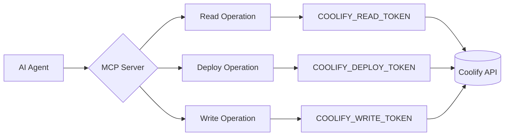

# 🔌 Coolify MCP Server — OpenCode Integration Guide

> **English — Written in a technical yet approachable tone so anyone new to the project can understand it.**

This document walks you through everything you need to know to use **Coolify MCP Server** from OpenCode. With 42 MCP tools you can entrust your Coolify infrastructure to your AI assistant, deploy safely, and monitor everything.

---

## 📋 Table of Contents

1. [Project Features](#1-project-features)
2. [What You Can Do When Added to OpenCode](#2-what-you-can-do-when-added-to-opencode)
3. [OpenCode Configuration](#3-opencode-configuration)
4. [Permissions and Operation Modes](#4-permissions-and-operation-modes)
5. [Example Usage Scenarios](#5-example-usage-scenarios)
6. [42-Tool Catalog](#6-42-tool-catalog)
7. [Security](#7-security)
8. [Setup (Quick Start)](#8-setup-quick-start)
9. [Dashboard](#9-dashboard)

---

## 1. Project Features

Coolify MCP Server is a **production-grade** MCP (Model Context Protocol) server that enables an AI assistant (OpenCode, Claude, Copilot, Cursor, etc.) to manage your Coolify infrastructure safely.

### 🚀 42 MCP Tools

The server exposes **42 MCP tools**:

| Category | Count | Description |
|----------|:----:|-------------|
| **Read-only tools** | 25 | Read-only — list, get, query |
| **Action tools** | 17 | Deploy, restart, create, update |

These tools are split across 10 domains: core read, GitHub discovery, scheduled tasks, deployments, backups, servers, teams, configuration, storage, and environment variables.

### 🔐 3 Operation Modes

| Mode | What It Does |
|------|--------------|
| `read-only` | Monitoring only — safe to use even in production |
| `deploy-only` | Read + deploy — write operations are blocked |
| `safe-write` | Full permissions — stop and env write require extra consent |

### 🩸 Secret Redaction
- Environment variable **VALUES are NEVER returned** —
- Sensitive fields like SSH private keys, database URLs, and email addresses are returned as `[REDACTED]`
- Audit events never contain secret values

### 🛡️ Production Guard
Mutations in production are **FULLY BLOCKED by default**.

| Default | Value | Effect |
|---------|-------|--------|
| `COOLIFY_DENY_PRODUCTION_MUTATIONS` | `true` | In production, no mutation works — not even deploy |
| `COOLIFY_ALLOW_PRODUCTION_DEPLOY` | `false` | Specific permission for production deploys |
| `COOLIFY_ALLOW_STOP` | `false` | Stop operations are globally disabled |
| `COOLIFY_ALLOW_ENV_WRITE` | `false` | Env var writes are globally disabled |

Production environments are recognized by names matching `production,prod` (case-insensitive).

### 🎟️ Least-Privilege Token Selection
Instead of a single master token, you can define **5 scoped tokens**:

| Token | Use Case |
|-------|----------|
| `COOLIFY_READ_TOKEN` | All read operations |
| `COOLIFY_SENSITIVE_TOKEN` | Sensitive data reads (env vars, logs) |
| `COOLIFY_WRITE_TOKEN` | Write operations |
| `COOLIFY_DEPLOY_TOKEN` | Deploy/start/restart |
| `COOLIFY_API_TOKEN` | Fallback if none of the above is set (full access) |

The server automatically selects **the lowest-privilege token** for each operation.

### 📊 Web Dashboard
- Starts automatically alongside the MCP server
- Address: **http://127.0.0.1:6489**
- Global search, command palette (Ctrl+K), dark/light mode
- All 42 tools are viewable, audit log is browsable
- Real-time status via KPI cards
Disable with: `MCP_DASHBOARD_ENABLED=false`

### 📝 Audit Logging
All mutation operations are recorded as structured audit events:

| Audit Event | When |
|-------------|------|
| `coolify.deployment.cancel` | When a deployment is cancelled |
| `coolify.database_backup_config.create` | When a backup config is created |
| `coolify.scheduled_task.create` | When a scheduled task is created |
| `coolify.application.config.update` | When an application config is updated |
| `coolify.database.config.update` | When a database config is updated |
| `coolify.storage.create` | When a storage mount is created |

Each audit event includes: operation name, resource, result (allowed/denied/error), and duration.

---

## 2. What You Can Do When Added to OpenCode

Coolify MCP Server offers 42 tools callable directly from OpenCode. Let's break them down by category.

### 📖 Read (Always available — all modes)
```
┌──────────────────────────────────────────────────────┐
│                    READ TOOLS (25)                    │
│          Available in all modes                       │
└──────────────────────────────────────────────────────┘
```
| Action | Tool Name | What It Does |
|--------|-----------|--------------|
| **List projects** | `coolify_list_projects` | Fetch all projects with optional name filter |
| **Project detail** | `coolify_get_project` | Project and environment info by UUID |
| **Project overview** | `coolify_project_overview` | Project + environments + resources + deployments — collects 4 API calls in one shot |
| **List resources** | `coolify_list_resources` | Filter by project, environment, type, status |
| **Resource detail** | `coolify_get_resource` | Application/service/database detail |
| **List deployments** | `coolify_list_deployments` | Newest first, with status filter |
| **Deployment detail** | `coolify_get_deployment` | Status, timestamp, commit, error summary |
| **Read logs** | `coolify_get_application_logs` | Log lines with secret redaction |
| **Env var keys** | `coolify_list_environment_variables` | **VALUES are never returned** |
| **GitHub Apps** | `coolify_list_github_apps` | Connected GitHub Apps |
| **Repo discovery** | `coolify_list_repositories` | Repos accessible via a GitHub App |
| **Branch discovery** | `coolify_list_branches` | Branches in a repo |
| **Scheduled tasks** | `coolify_list_scheduled_tasks` | List of cron jobs |
| **Task executions** | `coolify_get_task_executions` | Cron run history |
| **Backup list** | `coolify_list_database_backups` | Backup config and executions |
| **Server list** | `coolify_list_servers` | All servers (SSH keys and network info redacted) |
| **Server detail** | `coolify_get_server` | Single server detail |
| **Server resources** | `coolify_list_server_resources` | Resources on a server |
| **Server domains** | `coolify_list_server_domains` | Domains attached to a server |
| **Team info** | `coolify_get_current_team` | Active team: ID, name, permission scope |
| **Team members** | `coolify_list_team_members` | Team members (emails policy-gated) |
| **Storage mounts** | `coolify_list_storages` | Storage mounts for a resource |
| **App config update** | `coolify_update_application_config` | Health check, CPU, RAM, replicas — PATCH semantics |
| **DB config update** | `coolify_update_database_config` | CPU/RAM limits, name, description — PATCH semantics |
| **Deployment cancel** | `coolify_cancel_deployment` | Cancel queued or in-progress deployments |

### ✍️ Write (safe-write mode, extra permissions required)
```
┌──────────────────────────────────────────────────────┐
│                    WRITE TOOLS (13)                   │
│      safe-write mode + extra COOLIFY_ALLOW_* gates   │
└──────────────────────────────────────────────────────┘
```
| Action | Tool Name | Extra Permission | Description |
|--------|-----------|------------------|-------------|
| **Set env var** | `coolify_set_environment_variable` | `ALLOW_ENV_WRITE=true` | Single env var |
| **Bulk env vars** | `coolify_set_environment_variables` | `ALLOW_ENV_WRITE=true` | 1–50 env vars at once |
| **Stop** | `coolify_stop` | `ALLOW_STOP=true` | Stop a resource ⚠️ |
| **Create project** | `coolify_create_project` | — | New project |
| **Create environment** | `coolify_create_environment` | — | Add environment to a project |
| **Create application** | `coolify_create_application` | — | New application |
| **Create service** | `coolify_create_service` | — | Docker Compose service |
| **Create database** | `coolify_create_database` | — | PostgreSQL/MySQL/Redis etc. |
| **Create scheduled task** | `coolify_create_scheduled_task` | — | Define a cron job |
| **Update scheduled task** | `coolify_update_scheduled_task` | — | Edit a cron job |
| **Create backup config** | `coolify_create_backup_config` | — | Backup schedule |
| **Create storage mount** | `coolify_create_storage` | — | Volume/bind mount |
| **Validate server** | `coolify_validate_server` | — | Connection and config validation |
| **Update app config** | `coolify_update_application_config` | — | Health check, CPU, RAM, replicas |
| **Update DB config** | `coolify_update_database_config` | — | CPU/RAM limits, name, description |

> ⚠️ **CAUTION**: **Stop** and **Env Write** operations are OFF by default. You must set `COOLIFY_ALLOW_STOP=true` or `COOLIFY_ALLOW_ENV_WRITE=true` to enable them.

---

## 3. OpenCode Configuration

### 🖥️ Local (stdio)
Add to your `opencode.local.jsonc` file:

#### Read-Only (Default)
```jsonc
{
  "$schema": "https://opencode.ai/config.json",
  "mcp": {
    "coolify": {
      "type": "local",
      "command": ["node", "/path/to/mcp-coolify/dist/index.js"],
      "environment": {
        "COOLIFY_URL": "https://coolify.example.com",
        "COOLIFY_API_TOKEN": "{env:COOLIFY_API_TOKEN}",
        "COOLIFY_OPERATION_MODE": "read-only"
      }
    }
  }
}
```

> ⚠️ **IMPORTANT**: Use `dist/index.js` in the `command`, **not** `dist/index.mjs`! The build output is ES module format but the file extension is `.js`. The example file in the repo (`examples/opencode.local.jsonc`) may incorrectly say `.mjs` — the actual output is `.js`. Correct path: `/path/to/mcp-coolify/dist/index.js`

#### With Scoped Tokens (Least-Privilege)
```jsonc
{
  "$schema": "https://opencode.ai/config.json",
  "mcp": {
    "coolify": {
      "type": "local",
      "command": ["node", "/path/to/mcp-coolify/dist/index.js"],
      "environment": {
        "COOLIFY_URL": "https://coolify.example.com",
        // 5 scoped tokens — each operation uses the lowest privilege
        "COOLIFY_READ_TOKEN": "{env:COOLIFY_READ_TOKEN}",
        "COOLIFY_SENSITIVE_TOKEN": "{env:COOLIFY_SENSITIVE_TOKEN}",
        "COOLIFY_WRITE_TOKEN": "{env:COOLIFY_WRITE_TOKEN}",
        "COOLIFY_DEPLOY_TOKEN": "{env:COOLIFY_DEPLOY_TOKEN}",
        "COOLIFY_API_TOKEN": "{env:COOLIFY_API_TOKEN}"   // fallback
        // Safe start: read-only
        "COOLIFY_OPERATION_MODE": "read-only"
      }
    }
  }
}
```

#### With Deploy Permission
```jsonc
{
  "$schema": "https://opencode.ai/config.json",
  "mcp": {
    "coolify": {
      "type": "local",
      "command": ["node", "/path/to/mcp-coolify/dist/index.js"],
      "environment": {
        "COOLIFY_URL": "https://coolify.example.com",
        "COOLIFY_API_TOKEN": "{env:COOLIFY_API_TOKEN}",
        "COOLIFY_OPERATION_MODE": "deploy-only"
      }
    }
  }
}
```

#### Full Permission (Use with Caution!)
```jsonc
{
  "$schema": "https://opencode.ai/config.json",
  "mcp": {
    "coolify": {
      "type": "local",
      "command": ["node", "/path/to/mcp-coolify/dist/index.js"],
      "environment": {
        "COOLIFY_URL": "https://coolify.example.com",
        "COOLIFY_API_TOKEN": "{env:COOLIFY_API_TOKEN}",
        "COOLIFY_OPERATION_MODE": "safe-write",
        "COOLIFY_ALLOW_ENV_WRITE": "true",
        "COOLIFY_ALLOW_STOP": "true",
        "COOLIFY_DENY_PRODUCTION_MUTATIONS": "true" // protect production
      }
    }
  }
}
```

### 🌐 Remote (HTTP) Usage
If you run Coolify MCP Server remotely (HTTP/SSE transport):
```jsonc
{
  "$schema": "https://opencode.ai/config.json",
  "mcp": {
    "coolify-remote": {
      "type": "remote",
      "url": "https://coolify-mcp.example.com/mcp",
      "headers": {
        "Authorization": "Bearer {env:MCP_SERVER_API_KEY}"
      }
    }
  }
}
```

#### HTTP Transport Endpoints
When the server runs in HTTP mode (`MCP_TRANSPORT=http`) it exposes the following endpoints:

| Endpoint | Auth | What It Does |
|----------|------|--------------|
| `GET /healthz` | ❌ | Liveness check (`{"ok":true,"status":"alive"}`) |
| `GET /readyz` | ❌ | Readiness check (is the Coolify API reachable?) |
| `POST /mcp` | ✅ Bearer | All MCP tool calls go here |

---

## 4. Permissions and Operation Modes

### Mode Decision Matrix

| Tool Group | `read-only` | `deploy-only` | `safe-write` |
|------------|:-----------:|:-------------:|:------------:|
| **25 read tools** (list/get/health/logs/env-keys) | ✅ | ✅ | ✅ |
| **2 config update tools** (app/DB config) | ✅ | ✅ | ✅ |
| **Server validation** | ✅ | ✅ | ✅ |
| **15 action tools** (create/deploy/restart) | ❌ | ✅ | ✅ |
| **Stop** | ❌ | ❌ | ✅ + gate |
| **Env var write** | ❌ | ❌ | ✅ + gate |
| **Production mutations** | ❌ | ⚠️ | ⚠️ + deny gate |

### Additional Consent Gates

| Gate | Env Variable | Default | When Enabled |
|------|--------------|:-------:|--------------|
| **Stop Gate** | `COOLIFY_ALLOW_STOP=true` | `false` | `coolify_stop` becomes available |
| **Env Write Gate** | `COOLIFY_ALLOW_ENV_WRITE=true` | `false` | Env var create/update is enabled |
| **Production Deny** | `COOLIFY_DENY_PRODUCTION_MUTATIONS=true` | `true` | Set to `false` to allow production mutations |
| **Production Deploy** | `COOLIFY_ALLOW_PRODUCTION_DEPLOY=true` | `false` | Specific permission for production deploys |

### Production Guard Flow
```
An action tool is called
        │
        ▼
┌───────────────────┐
│ Allow Gate Check  │ ← COOLIFY_ALLOW_STOP, ALLOW_ENV_WRITE
│ Enabled?          │
└───────┬───────────┘
        │ (passed)
        ▼
┌───────────────────┐
│ Operation Mode    │ ← read-only/deploy-only/safe-write
│ Compatible?       │
└───────┬───────────┘
        │ (passed)
        ▼
┌───────────────────┐
│ Scope/Allowlist   │ ← UUID allowlist check
│ Compatible?       │
└───────┬───────────┘
        │ (passed)
        ▼
┌───────────────────┐
│ Production Guard  │ ← Is the environment named "production"?
│ Mutation allowed? │
└───────┬───────────┘
        │ (passed)
        ▼
┌───────────────────┐
│ Input Validation  │ ← Zod schema, cron, path traversal
│ Valid?            │
└───────┬───────────┘
        │ (passed)
        ▼
┌───────────────────┐
│ Audit Log         │ ← allowed/denied/error
│ Record            │
└───────┬───────────┘
        │
        ▼
     Execute Operation
```

If any step **fails**, the operation is rejected with a `POLICY_DENIED` error and an audit event is recorded.

---

## 5. Example Usage Scenarios

### Scenario 1: New Project Discovery
You just joined a team and don't know what's in Coolify. Proceed step by step:

```text
1. coolify_list_projects
   → Get the list of projects
2. coolify_get_project
   → Look at the details of a project you're interested in
   (environments, resource counts)
3. coolify_project_overview
   → Get a full project summary
   (environments + resources + deployment status + health)
```

**Usage in OpenCode:**
```
@coolify List all projects and give me a summary of the first one
```

```text
The AI does the following:
1. coolify_list_projects() → fetches projects
2. coolify_project_overview(project_uuid="...") → gets the summary
3. Presents you with a report
```

### Scenario 2: Deployment Status Check
You're wondering where a deployment stands:

```text
1. coolify_list_deployments
   → List recent deployments (with resource_uuid filter)
2. coolify_get_deployment
   → View details of a specific deployment
   (status, timestamps, commit, errors)
3. coolify_get_application_logs
   → Read application logs (redacted)
```

**Usage in OpenCode:**
```
@coolify Check the latest deployment status of the "my-app" application
```

### Scenario 3: New Application Deploy (safe-write mode)
Deploy an application from scratch:

```text
1. coolify_list_github_apps
   → Which GitHub Apps are connected?
2. coolify_list_repositories
   → Discover repos via the GitHub App
3. coolify_list_branches
   → See branches in the repo
4. coolify_create_application
   → Create the application
   (project, environment, repo, branch, build pack, port)
5. coolify_set_environment_variables
   → Bulk-add env vars
   (ALLOW_ENV_WRITE=true must be set)
6. coolify_deploy
   → Start the deployment
```

**Usage in OpenCode:**
```
@coolify Deploy the "my-app" application to the "staging" environment
```

### Scenario 4: Incident Response
There's an issue in production and you need to act fast:

```text
1. coolify_project_overview
   → Quick status assessment
2. coolify_list_deployments
   → Check recent deployments
3. coolify_get_deployment
   → Details of the problematic deployment
4. coolify_get_application_logs
   → Review error logs
5. coolify_cancel_deployment
   → Cancel if still in progress
6. coolify_restart
   → Roll back to the previous working version
```

**Usage in OpenCode:**
```
@coolify The "api" service is down in production, check the latest deployment and rollback if needed
```

### Scenario 5: Cron Debugging
A scheduled task isn't running:

```text
1. coolify_list_scheduled_tasks
   → List cron jobs on the application
2. coolify_get_task_executions
   → Check the status of recent runs
   (filter by status to see only failures)
3. coolify_update_scheduled_task
   → Fix the cron expression or command
   (safe-write mode required)
```

**Usage in OpenCode:**
```
@coolify Investigate why the "daily-backup" task isn't running
```

### Scenario 6: Database Backup
Add a backup plan for a PostgreSQL database:

```text
1. coolify_list_resources
   → Find databases (resource_type=database)
2. coolify_get_resource
   → View database details
3. coolify_create_backup_config
   → Create a backup schedule with a cron expression
   (safe-write mode required)
4. coolify_list_database_backups
   → Confirm backups are running
```

### Scenario 7: Server and Resource Discovery
You added a new server and want to discover its resources:

```text
1. coolify_list_servers
   → List all servers
2. coolify_get_server
   → View server details
   (SSH keys and network info are redacted)
3. coolify_list_server_resources
   → List resources on the server
4. coolify_list_server_domains
   → See domains attached to the server
5. coolify_validate_server
   → Validate server connectivity (safe-write mode required)
```

---

## 6. 42-Tool Catalog

Full list of all tools. Includes name, description, and read-only/destructive info.

### 📖 Read Tools (25)

#### Core Read Tools (10)
| # | Tool Name | Description | Read-only? |
|:-:|-----------|-------------|:----------:|
| 1 | `coolify_health` | MCP + Coolify API connectivity check. Returns health status, auth status, and latency. | ✅ |
| 2 | `coolify_list_projects` | List all projects. Optional name filter. | ✅ |
| 3 | `coolify_get_project` | Single project detail by UUID. Environments and resource counts. | ✅ |
| 4 | `coolify_list_resources` | Resource list filtered by project, environment, type, status, name. | ✅ |
| 5 | `coolify_get_resource` | Resource detail by UUID + type. Sensitive fields redacted. | ✅ |
| 6 | `coolify_project_overview` | Project summary — collects 4 API calls in one shot. | ✅ |
| 7 | `coolify_list_deployments` | Deployment list (newest first). Status and limit filters. | ✅ |
| 8 | `coolify_get_deployment` | Single deployment detail. Status, timestamp, commit, error. | ✅ |
| 9 | `coolify_get_application_logs` | Application logs. With secret redaction. | ✅ |
| 10 | `coolify_list_environment_variables` | Env var keys only. VALUES never returned. Metadata returned. | ✅ |

#### GitHub Discovery Tools (4)
| # | Tool Name | Description | Read-only? |
|:-:|-----------|-------------|:----------:|
| 11 | `coolify_list_github_apps` | Connected GitHub Apps (team and system-wide). | ✅ |
| 12 | `coolify_list_repositories` | Repos accessible via a GitHub App. Paginated, searchable. | ✅ |
| 13 | `coolify_list_branches` | Branches in a GitHub repository. | ✅ |
| 14 | `coolify_list_rollback_images` | Available Docker images for rollback. | ✅ |

#### Scheduled Task Read Tools (2)
| # | Tool Name | Description | Read-only? |
|:-:|-----------|-------------|:----------:|
| 15 | `coolify_list_scheduled_tasks` | Cron jobs on an application/service. | ✅ |
| 16 | `coolify_get_task_executions` | Scheduled task run history. Output is redacted. | ✅ |

#### Backup Read Tool (1)
| # | Tool Name | Description | Read-only? |
|:-:|-----------|-------------|:----------:|
| 17 | `coolify_list_database_backups` | Database backup configs and executions. Sensitive paths redacted. | ✅ |

#### Server Read Tools (4)
| # | Tool Name | Description | Read-only? |
|:-:|-----------|-------------|:----------:|
| 18 | `coolify_list_servers` | All servers. SSH keys and network info redacted. | ✅ |
| 19 | `coolify_get_server` | Single server detail. Sensitive info redacted. | ✅ |
| 20 | `coolify_list_server_resources` | Resources on a server (with type and status filter). | ✅ |
| 21 | `coolify_list_server_domains` | Domains attached to a server. | ✅ |

#### Team Read Tools (2)
| # | Tool Name | Description | Read-only? |
|:-:|-----------|-------------|:----------:|
| 22 | `coolify_get_current_team` | Active team: ID, name, permission scope. | ✅ |
| 23 | `coolify_list_team_members` | Team members. Emails policy-gated, redacted by default. | ✅ |

#### Storage Read Tool (1)
| # | Tool Name | Description | Read-only? |
|:-:|-----------|-------------|:----------:|
| 24 | `coolify_list_storages` | Storage mounts. Sensitive host paths redacted. | ✅ |

#### Configuration Update Tools (2 — require safe-write)
| # | Tool Name | Description | Destructive? |
|:-:|-----------|-------------|:-----------:|
| 25 | `coolify_update_application_config` | Application config: health check, CPU/RAM limits, replicas, ports, build settings. PATCH semantics. Audit: `coolify.application.config.update` | ⚠️ Idempotent |
| 26 | `coolify_update_database_config` | Database config: CPU/RAM limits, name, description. PATCH semantics. Audit: `coolify.database.config.update` | ⚠️ Idempotent |

### ✍️ Action Tools (17)

#### Deployment Action Tools (5)
| # | Tool Name | Description | Destructive? | Policy |
|:-:|-----------|-------------|:-----------:|--------|
| 1 | `coolify_deploy` | Deploy an application, service, or database. Subject to operation mode, allowlist, and production guard. | ⚠️ | Mode + Scope + Production |
| 2 | `coolify_start` | Start a stopped resource. | ✅ | Mode + Scope |
| 3 | `coolify_restart` | Restart a resource. Production guard mandatory. | ⚠️ | Mode + Scope + Production |
| 4 | `coolify_rollback_application` | Roll back to a previous image tag/commit. | ⚠️ | Mode + Scope + Production |
| 5 | `coolify_cancel_deployment` | Cancel a queued or in-progress deployment. | ✅ | Mode + Scope |

#### Creation Action Tools (8)
| # | Tool Name | Description | Destructive? | Policy |
|:-:|-----------|-------------|:-----------:|--------|
| 6 | `coolify_create_project` | Create a new project. | ✅ | Mode + Scope |
| 7 | `coolify_create_environment` | Create a new environment in a project. | ✅ | Mode + Scope |
| 8 | `coolify_create_application` | Create a new application in a project environment. | ✅ | Mode + Scope |
| 9 | `coolify_create_service` | Create a new service in a project environment. | ✅ | Mode + Scope |
| 10 | `coolify_create_database` | Create a new database. Passwords are NEVER returned. | ✅ | Mode + Scope |
| 11 | `coolify_create_backup_config` | Create a backup configuration for a database. | ✅ | Mode + Scope + Production |
| 12 | `coolify_create_scheduled_task` | Create a cron job. Cron expression is validated. Audit: `coolify.scheduled_task.create` | ❌ | Mode + Scope + Production |
| 13 | `coolify_update_scheduled_task` | Update a cron job. Name, command, schedule, enabled. | ❌ | Mode + Scope + Production |

#### Server Validation Tool (1)
| # | Tool Name | Description | Destructive? | Policy |
|:-:|-----------|-------------|:-----------:|--------|
| 14 | `coolify_validate_server` | Validate server connectivity and configuration. Processes as a mutation (audit). | ❌ | Mode + Scope |

#### Storage Action Tool (1 — safe-write)
| # | Tool Name | Description | Destructive? | Policy |
|:-:|-----------|-------------|:-----------:|--------|
| 15 | `coolify_create_storage` | Create a storage mount. Has path traversal protection. Audit: `coolify.storage.create` | ❌ | Mode + Scope + Production |

### Error Codes
| Code | Meaning | Retry? |
|------|---------|:------:|
| `AUTHENTICATION_FAILED` | Token missing or invalid | ❌ |
| `PERMISSION_DENIED` | Token lacks required permissions | ❌ |
| `POLICY_DENIED` | MCP policy blocked it (mode/scope/production) | ❌ |
| `RESOURCE_NOT_FOUND` | Resource not found (404) | ❌ |
| `RATE_LIMITED` | Rate limit exceeded (429) | ✅ |
| `COOLIFY_UNAVAILABLE` | Coolify API unreachable or 5xx | ✅ |
| `REQUEST_TIMEOUT` | Request exceeded 30s | ✅ |
| `VALIDATION_ERROR` | Invalid input parameters | ❌ |
| `UPSTREAM_ERROR` | General Coolify API error | varies |
| `INTERNAL_ERROR` | MCP server internal error | ❌ |

### Success Response Format
```json
{
  "ok": true,
  "summary": "3 projects found",
  "data": [ /* ... */ ],
  "meta": {
    "durationMs": 42,
    "truncated": false
  }
}
```

### Policy Denial Response
```json
{
  "ok": false,
  "summary": "Operation denied by policy",
  "error": {
    "code": "POLICY_DENIED",
    "message": "Operation mode 'read-only' — 'deploy' operations are not allowed",
    "retryable": false
  },
  "meta": {
    "durationMs": 5
  }
}
```

---

## 7. Security

Coolify MCP Server's security model is designed around the principle of **defense in depth** to prevent an AI assistant from harming your infrastructure.

### 🔒 Layer 1: Environment Variable Protection
```
┌─────────────────────────────────────────────────────────────────┐
│                                                                  │
│  coolify_list_environment_variables                             │
│                                                                  │
│  Returned:  KEYS ✅                                              │
│  Returned:  Metadata (created_at, updated_at, is_literal) ✅     │
│  NEVER RETURNED: VALUES ❌❌                                     │
│                                                                  │
│  coolify_set_environment_variable                               │
│  Sent: VALUE received ✅                                         │
│  In response: VALUE NEVER returned ❌                            │
│                                                                  │
└─────────────────────────────────────────────────────────────────┘
```

### 🔒 Layer 2: Log and Secret Redaction
Log lines, audit events, and API responses are scanned against these patterns:

| Pattern | Action |
|---------|--------|
| `Bearer [token]` | `Bearer [REDACTED]` |
| `password=...` | `password=[REDACTED]` |
| `secret=...` | `secret=[REDACTED]` |
| `api_key=...` | `api_key=[REDACTED]` |
| SSH private keys | `[REDACTED]` |
| Database connection URLs | `[REDACTED]` |
| Email addresses | `[REDACTED]` (policy-gated) |

### 🔒 Layer 3: Production Guard
Mutations in production are **FULLY BLOCKED by default**:

```bash
# No mutations work in production (default)
COOLIFY_DENY_PRODUCTION_MUTATIONS=true
# Allow deploy only (DENY_PRODUCTION_MUTATIONS must be false)
COOLIFY_ALLOW_PRODUCTION_DEPLOY=false  # disabled by default
# Stop is never enabled by default
COOLIFY_ALLOW_STOP=false  # disabled by default
```

### 🔒 Layer 4: Least-Privilege Tokens


**The lowest-privilege token** is automatically selected for each operation. The master token is never used for a read operation.

### 🔒 Layer 5: Allowlists
Optionally restrict access to specific resources:

```bash
# Only these projects
COOLIFY_ALLOWED_PROJECT_UUIDS="uuid1,uuid2,uuid3"
# Only these environments
COOLIFY_ALLOWED_ENVIRONMENT_UUIDS="uuid1,uuid2"
# Only these resources
COOLIFY_ALLOWED_RESOURCE_UUIDS="uuid1,uuid2"
```

### 🔒 Layer 6: Additional Protections

| Protection | Description |
|------------|-------------|
| **Timing-safe API key comparison** | Timing attack prevention for HTTP transport |
| **Path traversal protection** | `../` and `..\\` are blocked in storage mounts |
| **Cron validation** | Cron expressions are validated on scheduled task creation |
| **Field allowlisting** | Config updates can only change documented fields |
| **DB password protection** | `coolify_create_database` never returns passwords/connection strings |
| **Redacted audit** | Audit events never contain secret values |

### 🔒 Layer 7: No Secrets in Dashboard
No secret values are displayed in the web dashboard:
- Env var VALUES are not shown
- Tokens are not shown
- SSH keys are not shown
- DB connection strings are not shown

---

## 8. Setup (Quick Start)

> 💡 **Estimated time: 5 minutes**

### Requirements
- **Node.js >= 18**
- A Coolify instance (and API token)
- OpenCode (or any MCP client)

### Step-by-Step Setup
```bash
# 1. Clone the repo
git clone <repo-address> mcp-coolify
cd mcp-coolify
# 2. Install dependencies
npm install
# 3. Create and edit the .env file
cp .env.example .env
```

Open the `.env` file and make these minimum changes:

```bash
# Required: Coolify instance URL
COOLIFY_URL=https://coolify.yourcompany.com
# Required: At least one API token
COOLIFY_API_TOKEN=your-api-token-here
# Recommended: Operation mode
COOLIFY_OPERATION_MODE=read-only  # Safe start
```

Then continue:

```bash
# 4. Build (builds both MCP and dashboard)
npm run build:all
# 5. Test (health check)
npm start
# In console you should see: "MCP Server ready on stdio"
# If dashboard started: "Dashboard: http://127.0.0.1:6489"
```

### Adding to OpenCode
Add to your `opencode.local.jsonc` file:

```jsonc
{
  "$schema": "https://opencode.ai/config.json",
  "mcp": {
    "coolify": {
      "type": "local",
      "command": ["node", "/path/to/mcp-coolify/dist/index.js"],
      "environment": {
        "COOLIFY_URL": "https://coolify.yourcompany.com",
        "COOLIFY_API_TOKEN": "{env:COOLIFY_API_TOKEN}",
        "COOLIFY_OPERATION_MODE": "read-only"
      }
    }
  }
}
```

### Verify
Send a test message to your AI assistant:

```
@coolify Run a health check
```

You should receive an output similar to:

```json
{
  "ok": true,
  "coolifyUrl": "https://coolify.yourcompany.com",
  "authStatus": "authenticated",
  "latencyMs": 42,
  "transport": "stdio"
}
```

### Troubleshooting

| Problem | Solution |
|---------|----------|
| `Configuration validation failed: coolifyUrl: Required` | `COOLIFY_URL` not set. Check your `.env`. |
| `Configuration validation failed: coolifyUrl: Invalid URL` | URL is not valid. Include the protocol (`https://`). |
| `AUTHENTICATION_FAILED` — "No Coolify API token configured" | Set `COOLIFY_API_TOKEN` or one of the scoped tokens. |
| `POLICY_DENIED` — "Production mutations are denied" | Environment name matches "production". You can allow it with `COOLIFY_DENY_PRODUCTION_MUTATIONS=false`. |
| `POLICY_DENIED` — "Stop operations are disabled" | Set `COOLIFY_ALLOW_STOP=true`. |
| Logs show fewer lines than expected | `COOLIFY_LOG_MAX_LINES` defaults to 200. You can increase it up to 1000. |

---

## 9. Dashboard

Coolify MCP Server automatically starts a **web dashboard** alongside the MCP server.

### Features

| Feature | Details |
|---------|---------|
| **Address** | `http://127.0.0.1:6489` (localhost only) |
| **Auto-starts** | Along with MCP, no separate command needed |
| **Global search** | Instant search across all entities (projects, resources, deployments) |
| **Command palette** | `Ctrl+K` for quick commands |
| **Theme** | Dark/Light mode support |
| **Tool catalog** | All 42 tools are viewable |
| **Audit log** | All mutation history is browsable |
| **KPI cards** | Real-time status: project count, resource status, recent deployments |

### Configuration
```bash
# Disable the dashboard entirely
MCP_DASHBOARD_ENABLED=false
# Change host and port (default: 127.0.0.1:6489)
MCP_DASHBOARD_HOST=127.0.0.1
MCP_DASHBOARD_PORT=6489
```

### Dashboard vs MCP
```
┌─────────────────────────────────────────────────────┐
│                   Coolify MCP Server                 │
├──────────────────────┬──────────────────────────────┤
│    MCP (stdio/HTTP)  │    Web Dashboard (Fastify)   │
│                      │                              │
│  • AI assistants     │  • Human users               │
│  • Tool calls        │  • Visual interface          │
│  • JSON responses    │  • Global search             │
│  • 42 tools          │  • Audit log viewing          │
│                      │  • KPI cards                  │
└──────────────────────┴──────────────────────────────┘
        ▲                            ▲
        │                            │
        │        Same Process        │
        └────────────────────────────┘
```

The dashboard runs in the same Node.js process as the MCP server. No separate process needs to be started.

---

## 🎯 Summary

Coolify MCP Server enables your AI assistants to manage your Coolify infrastructure in a **safe, controlled, and auditable** way:

| Feature | Value |
|---------|-------|
| **Total Tools** | 42 (25 read-only + 17 action) |
| **Operation Modes** | read-only / deploy-only / safe-write |
| **Security** | 7 layers of defense |
| **Secret Redaction** | Automatic + env var VALUES never returned |
| **Production Guard** | Mutations blocked by default |
| **Token Selection** | Least-privilege, 5 scoped tokens |
| **Dashboard** | http://127.0.0.1:6489 |
| **Audit** | All mutations recorded |

> **First step**: Start with `read-only` mode, then move to `deploy-only` as you get comfortable, and finally `safe-write`. In production, `read-only` is the safest.

---

*This document was prepared by thoroughly reviewing and testing the project's source code — not automatically generated. If you find anything missing or incorrect, don't hesitate to update it.*
<!-- Last updated: 2026-07-12 -->
<!-- Total tool count: counted from src/server/create-server.ts: 23 read + 2 config (safe-write) + 17 action = 42 -->
